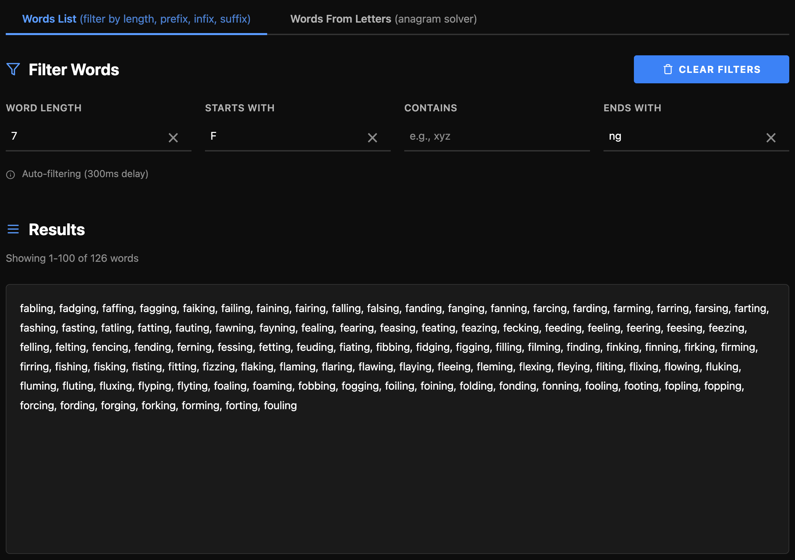
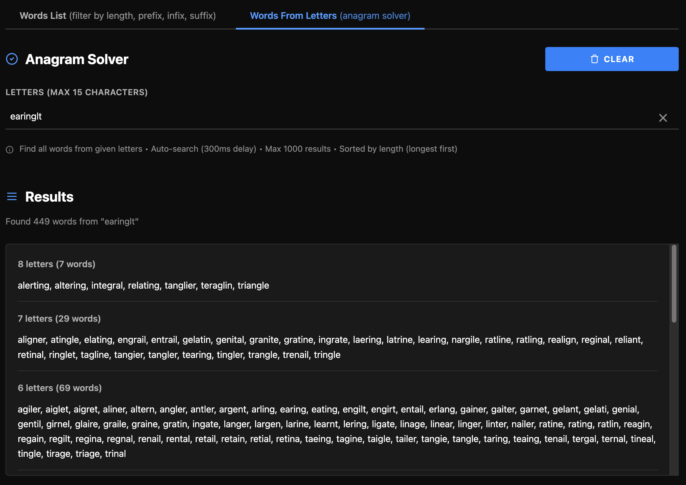
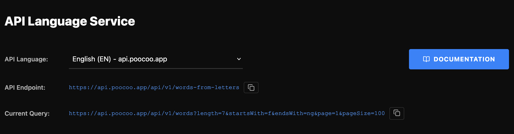

# Poocoo API - Word Search, Anagram Solver & Dictionary API

<div align="center">
  
  
  [](https://tjaworski997.github.io/poocoo.api.demo/)
  [](https://api.poocoo.app/docs)
  [](https://api.poocoo.pl)
  
  **Interactive demo and documentation for Poocoo Dictionary API**
  
  [Live Demo](https://tjaworski997.github.io/poocoo.api.demo/) | [Documentation](https://api.poocoo.app/docs) | [API Endpoint](https://api.poocoo.pl)
</div>

---

## What is Poocoo API?

Poocoo API is a powerful **word search engine** and **anagram solver** that provides access to comprehensive dictionaries in multiple languages. Perfect for word games, language learning apps, spell checkers, and linguistic research.

### Key Features

- **Advanced Word Search** - Filter words by length, prefix, suffix, or containing letters
- **Anagram Solver** - Find all possible words from given letters
- **Multi-Language Support** - English, German, French, and Polish dictionaries
- **Fast & Reliable** - Optimized for speed with pagination support
- **Interactive Demo** - Test all API features in real-time
- **Complete Documentation** - Clear examples and API reference

---

## Available APIs

Poocoo API is available in **4 languages** with dedicated endpoints:

| Language | API Endpoint | Demo | Documentation |
|----------|--------------|------|---------------|
| English | [api.poocoo.app](https://api.poocoo.app) | [Try it](https://api.poocoo.app) | [Docs](https://api.poocoo.app/docs) |
| Polish | [api.poocoo.pl](https://api.poocoo.pl) | [Try it](https://api.poocoo.pl) | [Docs](https://api.poocoo.pl/docs) |
| German | [api.poocoo.de](https://api.poocoo.de) | [Try it](https://api.poocoo.de) | [Docs](https://api.poocoo.de/docs) |
| French | [api.poocoo.fr](https://api.poocoo.fr) | [Try it](https://api.poocoo.fr) | [Docs](https://api.poocoo.fr/docs) |

---

## Quick Start

### Word Search API

Search and filter words with multiple criteria:

```bash
# Find all 5-letter words starting with "app"
GET https://api.poocoo.app/api/v1/words?length=5&startsWith=app

# Find words containing "tion"
GET https://api.poocoo.app/api/v1/words?contains=tion

# Find words ending with "ing"
GET https://api.poocoo.app/api/v1/words?endsWith=ing

# Combine multiple filters
GET https://api.poocoo.app/api/v1/words?length=7&startsWith=com&endsWith=ing
```

### Anagram Solver API

Find all words that can be made from given letters:

```bash
# Find anagrams from letters "secure"
GET https://api.poocoo.app/api/v1/words-from-letters?letters=secure

# Response: rescue, secure, recuse, ceruse...
```

---

## Screenshots

### Interactive Word Search


*Filter words by length, prefix, suffix, or containing letters with real-time results*

### Anagram Solver


*Find all possible words from any combination of letters - perfect for word games!*

### Multi-Language Support


*Switch between English, German, French, and Polish dictionaries instantly*

---

## Use Cases

### Word Games
- **Scrabble Helper** - Find valid words from letter tiles
- **Wordle Solver** - Search by letter positions and constraints
- **Crossword Puzzles** - Filter words by length and known letters
- **Anagram Games** - Solve letter scrambles instantly

### Language Learning
- **Vocabulary Builder** - Explore word patterns and families
- **Spelling Practice** - Validate word correctness
- **Pattern Recognition** - Study prefixes, suffixes, and word structure

### Application Development
- **Spell Checkers** - Validate user input against dictionary
- **Autocomplete** - Suggest words based on partial input
- **Word Generators** - Create word lists for games or tests
- **Linguistic Analysis** - Research word patterns and frequencies

### Research & Education
- **Linguistic Studies** - Analyze word patterns across languages
- **Educational Tools** - Build interactive learning applications
- **Data Analysis** - Process and validate text data

---

## API Endpoints

### 1. Word Search - `/api/v1/words`

Filter and search words with multiple criteria.

**Parameters:**
- `length` (integer) - Filter by exact word length
- `startsWith` (string) - Words starting with these letters
- `contains` (string) - Words containing these letters
- `endsWith` (string) - Words ending with these letters
- `page` (integer) - Page number for pagination (default: 1)
- `pageSize` (integer) - Items per page (default: 100, max: 1000)

**Example Response:**
```json
{
  "data": ["apple", "apply", "application"],
  "pagination": {
    "page": 1,
    "pageSize": 100,
    "totalItems": 3,
    "totalPages": 1
  }
}
```

### 2. Anagram Solver - `/api/v1/words-from-letters`

Find all valid words that can be formed from given letters.

**Parameters:**
- `letters` (string, required) - Letters to form words from (max 15 characters)

**Example Response:**
```json
{
  "letters": "secure",
  "results": ["rescue", "secure", "recuse", "ceruse", "ceres", "scree"],
  "count": 6
}
```

---

## Interactive Demo Features

Our [live demo](https://tjaworski997.github.io/poocoo.api.demo/) includes:

- **Real-time API Testing** - See results as you type
- **Multiple Filters** - Combine search criteria
- **Anagram Solver** - Built-in letter scramble tool
- **Language Switcher** - Test all 4 language APIs
- **Copy Query URLs** - Share or bookmark searches
- **Responsive Design** - Works on desktop and mobile
- **Pagination** - Navigate through large result sets
- **LocalStorage** - Remembers your preferences

---

## Technical Details

### Built With
- **Vanilla JavaScript** - No framework dependencies
- **RESTful API** - Standard HTTP methods
- **JSON Responses** - Easy to parse and integrate
- **CORS Enabled** - Use from any domain
- **Rate Limiting** - Fair usage for all users

### Response Format
All API responses follow a consistent JSON structure:
```json
{
  "data": [...],
  "pagination": {
    "page": 1,
    "pageSize": 100,
    "totalItems": 1523,
    "totalPages": 16
  }
}
```

### Error Handling
Errors return appropriate HTTP status codes with descriptive messages:
```json
{
  "error": "Invalid parameter",
  "message": "Length must be a positive integer"
}
```

---

## Documentation

Comprehensive API documentation is available for each language:

- **English API**: [api.poocoo.app/docs](https://api.poocoo.app/docs)
- **Polish API**: [api.poocoo.pl/docs](https://api.poocoo.pl/docs)
- **German API**: [api.poocoo.de/docs](https://api.poocoo.de/docs)
- **French API**: [api.poocoo.fr/docs](https://api.poocoo.fr/docs)

---

## Why Choose Poocoo API?

### For Developers
- **Easy Integration** - Simple REST API with clear documentation
- **High Performance** - Fast response times with efficient caching
- **Reliable** - 99.9% uptime guarantee
- **Scalable** - Handles high traffic with pagination

### For Language Enthusiasts
- **Comprehensive** - Large dictionaries in 4 languages
- **Accurate** - Regularly updated word lists
- **Versatile** - Multiple search methods and filters
- **Multi-lingual** - Cross-language word exploration

### For Game Developers
- **Game-Ready** - Perfect for word game mechanics
- **Competitive** - Fast enough for real-time gameplay
- **Flexible** - Adapt to any game rules or constraints
- **Universal** - Works on web, mobile, and desktop

---

## Contributing

Contributions are welcome! If you find bugs or have suggestions:

1. [Report Issues](https://github.com/tjaworski997/poocoo.api.demo/issues)
2. [Suggest Features](https://github.com/tjaworski997/poocoo.api.demo/discussions)
3. Submit Pull Requests

---

## License

This demo application is open source. The API itself is provided as-is for public use.

---

## Links

- **Live Demo**: [tjaworski997.github.io/poocoo.api.demo](https://tjaworski997.github.io/poocoo.api.demo/)
- **API Documentation**: [api.poocoo.app/docs](https://api.poocoo.app/docs)
- **GitHub Repository**: [github.com/tjaworski997/poocoo.api.demo](https://github.com/tjaworski997/poocoo.api.demo)

---

## Keywords

`word search api` · `anagram solver` · `dictionary api` · `word finder` · `spell checker` · `word game api` · `scrabble helper` · `crossword solver` · `word validation` · `multi-language dictionary` · `words from letters` · `word search engine` · `linguistic api` · `vocabulary api` · `word patterns` · `word filter` · `letter combinations` · `word lookup` · `language tools` · `text analysis`

---

<div align="center">
  
**Made with by [Poocoo](https://poocoo.pl)**

[Words From Letters - English](https://poocoo.app) | [Słowa z Liter - Polski](https://poocoo.pl) | [Wörter aus Buchstaben - Deutsch](https://poocoo.de) | [Mots à partir de Lettres - Français](https://poocoo.fr)
  
Star this repo if you find it helpful!
  
</div>
